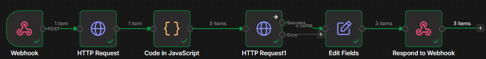

Sistema de recomendação de filmes feito para o projeto final da matéria "Programação Aplicada em Python" utilizando n8n

 

Usuário → IA → Array de títulos → Code Node → 1 item por filme → API TMDB/OMDb

Sistema de recomendação de filmes desenvolvido com n8n, Groq AI e TMDB API.

O usuário envia um gênero e uma descrição do tipo de filme desejado. O workflow envia essas informações para uma IA, que retorna 3 recomendações de filmes em inglês. Em seguida, o n8n consulta a API do TMDB para buscar informações detalhadas de cada filme, como título, nota e sinopse, retornando tudo formatado para o usuário.

Tecnologias utilizadas
n8n
Groq API
TMDB API
JavaScript
REST API